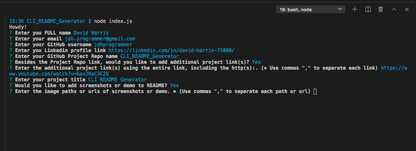
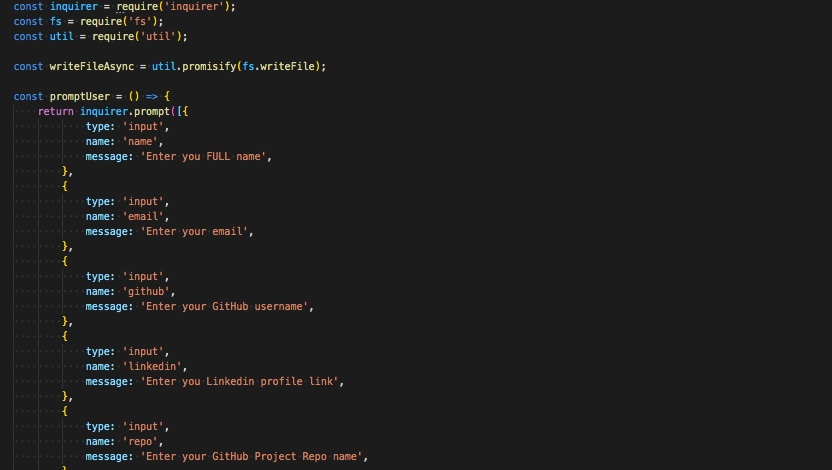
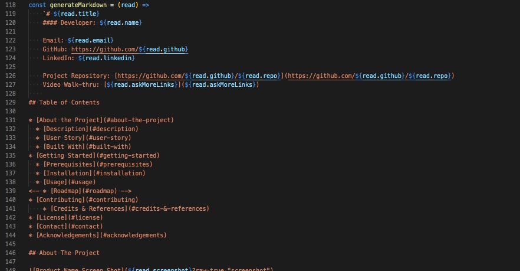

# CLI README Generator

[](https://github.com/jdhprogrammer) [](https://github.com/jdhprogrammer/CLI_README_Generator) [](https://github.com/jdhprogrammer/CLI_README_Generator) [](https://choosealicense.com/licenses/mit/)

## Developer
### David Harris

Email: jdh.programmer@gmail.com  
GitHub: https://github.com/jdhprogrammer  
LinkedIn: https://linkedin.com/in/david-harris-75080/  

Project Repository: [https://github.com/jdhprogrammer/CLI_README_Generator](https://github.com/jdhprogrammer/CLI_README_Generator)  

### Walk-through Video

https://youtu.be/l-H0cVBeSls

## Table of Contents

* [About the Project](#about-the-project)
  * [Description](#description)
  * [User Story](#user-story)
  * [Technologies](#technologies)

* [Getting Started](#getting-started)
  * [Prerequisites](#prerequisites)
  * [Installation](#installation)
  * [Usage](#usage)

* [Sceenshots](#screenshots)
* [Contributing](#contributing)
* [Acknowledgements](#acknowledgements)
* [License](#license)
* [Contact](#contact)

## About The Project
  
<kbd></kbd>

### Description

When creating an open source project on GitHub, it’s important to have a high-quality README for the app. This should include what the app is for, how to use the app, how to install it, how to report issues, and how to make contributions—this last part increases the likelihood that other developers will contribute to the success of the project.

#### User Story

AS A developer, I WANT a README generator, SO THAT I can quickly create a professional README for a new Project.


### Technologies

```
* Javascript.  * Markdown.  * Node.js.  * NPM Inquirer.  
```


## Getting Started

### Prerequisites

Go to Node.js Website and download Node. [https://nodejs.org/en/download/](https://nodejs.org/en/download/)

        
### Installation

1. Clone the Repo to your Local machine using - git clone https://github.com/jdhprogrammer/CLI_README_Generator.git  2. In the Local Repo folder, run command: npm init -y  3. Check package.json for Inquirer Dependency.
  
### Usage
  
Open Repo folder in VSCODE Integrated Terminal. Then Run command - node index.js. Last simply answer the prompt questions with your information, links, etc. At the end it will create a README file for you in the folder, with all of your Answers populated throughout.
  
  

## Contributing

Contributions are what make the open source community such an amazing place to be learn, inspire, and create. 
Any contributions you make are **greatly appreciated**.

1. Fork the Repo on GitHub @ [https://github.com/jdhprogrammer/CLI_README_Generator](https://github.com/jdhprogrammer/CLI_README_Generator) 
2. Create your Feature Branch ('git checkout -b feature/AmazingFeature')
3. Commit your Changes ('git commit -m "Add some AmazingFeature"')
4. Push to the Branch ('git push origin feature/AmazingFeature")
5. Open a Pull Request  
  
### Screenshots

<kbd></kbd><kbd></kbd><kbd></kbd><kbd></kbd><kbd> </kbd>
<br>
<br>
  
  
### Acknowledgements

Dane Edwards - SMU Coding BootCamp Teacher.<br>Andrew Layendecker - SMU Codding Bootcamp Assistant Teacher<br>NPM Inquirer - https://www.npmjs.com/package/inquirer<br>Shields IO - https://shields.io/<br>Research Ideas from Bing Z - https://github.com/imbingz<br>Othneil Drew - BestREADME Template - https://github.com/othneildrew<br>RegEx Testing - https://www.regextester.com/94502<br>
  

## License

Distributed under the [MIT](https://choosealicense.com/licenses/mit/). See LICENSE for more information.
  

## Contact

David Harris - jdh.programmer@gmail.com

Project Link: [https://github.com/jdhprogrammer/CLI_README_Generator](https://github.com/jdhprogrammer/CLI_README_Generator)

<br>

Copyright © 2020 [DAVID HARRIS](https://github.com/jdhprogrammer)
  

  