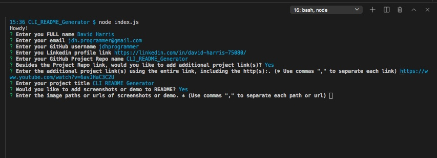
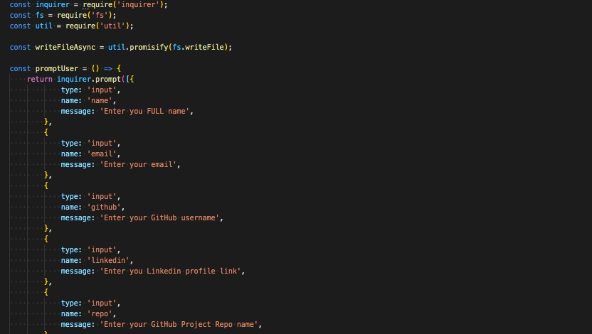
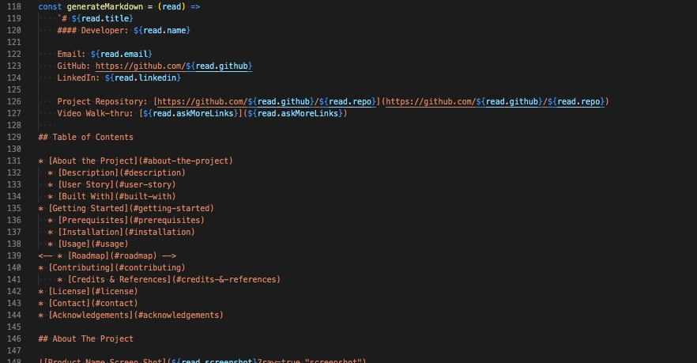
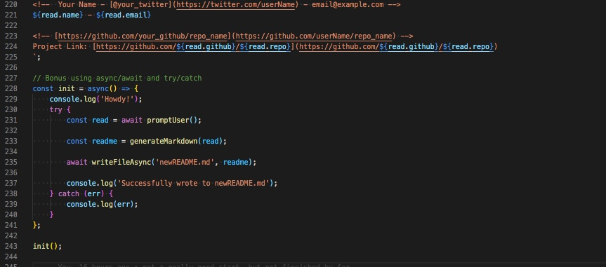

# CLI README Generator

[](https://github.com/jdhprogrammer) [](https://github.com/jdhprogrammer/CLI_README_Generator)
[](https://github.com/jdhprogrammer/CLI_README_Generator)
[](https://choosealicense.com/licenses/MIT/)

#### Developer: David Harris

Email: jdh.programmer@gmail.com  
  GitHub: https://github.com/jdhprogrammer  
LinkedIn: https://linkedin.com/in/david-harris-75080/  

Project Repository: [https://github.com/jdhprogrammer/CLI_README_Generator](https://github.com/jdhprogrammer/CLI_README_Generator)  
https://www.youtube.com/watch?v=6avJHaC3C2U<br> https://www.youtube.com/watch?v=7EmboKQH8lM<br> https://www.youtube.com/watch?v=EZ05e7EMOLM

### Screenshots

<kbd></kbd><kbd></kbd><kbd></kbd><kbd></kbd>
    
## Table of Contents

* [About the Project](#about-the-project)
  * [Description](#description)
  * [User Story](#user-story)
  * [Built With](#built-with)
* [Getting Started](#getting-started)
  * [Prerequisites](#prerequisites)
  * [Installation](#installation)
  * [Usage](#usage)
* [Contributing](#contributing)
    * [Credits & References](#credits-&-references)
* [License](#license)
* [Contact](#contact)
* [Acknowledgements](#acknowledgements)

## About The Project

<!-- [Product Name Screen Shot](./Assets/Screenshots/CLI_README_Prompts.jpeg, ./Assets/Screenshots Inquirer_PromtUser.jpeg, ./Assets/Screenshots/Markdown_string_interpolation.jpeg, ./Assets Screenshots/Write_Template_toFile.jpeg?raw=true "screenshot") -->

### Description

When creating an open source project on GitHub, it’s important to have a high-quality README for the app. This should include what the app is for, how to use the app, how to install it, how to report issues, and how to make contributions—this last part increases the likelihood that other developers will contribute to the success of the project.

#### User Story

AS A developer, I WANT a README generator, SO THAT I can quickly create a professional README for a new Project.


### Technologies Used

```
<kbd>* Javascript.</kbd><kbd>* Markdown.</kbd><kbd>* Node.js.</kbd><kbd>* NPM Inquirer.</kbd>
```


## Getting Started

### Prerequisites

$

        
### Installation & Usage

1. Clone the Repo to your Local machine using - git clone https://github.com/jdhprogrammer/CLI_README_Generator.git  2. In the Local Repo folder, run command: npm init -y  3. Check package.json for Inquirer Dependency.
  
  
Open Repo folder in VSCODE Integrated Terminal. Then Run command - node index.js. Last simply answer the prompt questions with your information, links, etc. At the end it will create a README file for you in the folder, with all of your Answers populated throughout.
  
  

## Contributing

Contributions are what make the open source community such an amazing place to be learn, inspire, and create. 
Any contributions you make are **greatly appreciated**.

1. Fork the Repo on GitHub @ [https://github.com/jdhprogrammer/CLI_README_Generator](https://github.com/jdhprogrammer/CLI_README_Generator) 
2. Create your Feature Branch ('git checkout -b feature/AmazingFeature')
3. Commit your Changes ('git commit -m "Add some AmazingFeature"')
4. Push to the Branch ('git push origin feature/AmazingFeature")
5. Open a Pull Request
  
  
### Credits & References

Dane Edwards, Andrew Layendecker.
  

## License

Distributed under the MIT. See LICENSE for more information.
  

## Contact

David Harris - jdh.programmer@gmail.com

Project Link: [https://github.com/jdhprogrammer/CLI_README_Generator](https://github.com/jdhprogrammer/CLI_README_Generator)
